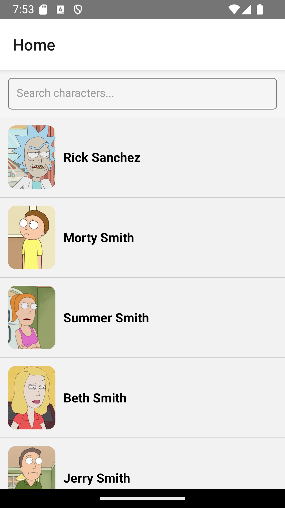

## Getting Started

This React Native app allows users to explore and filter characters from the popular animated series Rick and Morty. It provides a clean interface to browse through characters, search for specific ones, and navigate to detailed character information.

### Features

- Browse through a list of Rick and Morty characters
- Search for characters by name
- Navigate to individual character details
- Pagination support for loading more characters

### Getting Started

To run this app:

    1. Clone the repository
    2. Ensure you have Node.js installed
    2. Install dependencies: npm install or yarn
    3. Start the app: npm run ios (for iOS simulator) or npm run android (for Android emulator)

### Project Structure

The app follows a modular structure with the following main folders:

- <kbd>components</kbd>: React Native components
- <kbd>hooks</kbd>: Custom hooks for data fetching and state management
- <kbd>navigation</kbd>: Navigation configuration
- <kbd>services</kbd>: External service-related code (e.g., API clients)
- <kbd>types</kbd>: TypeScript types for the app

#### License

This project is open-source and licensed under the MIT License - see the LICENSE file for details.

#### Acknowledgments

Data provided by the Rick and Morty API  (https://rickandmortyapi.com/)
